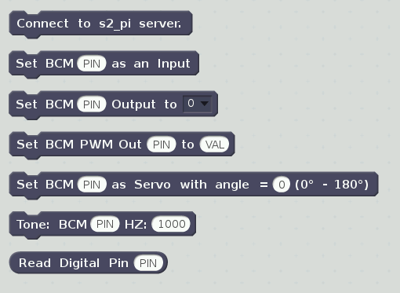
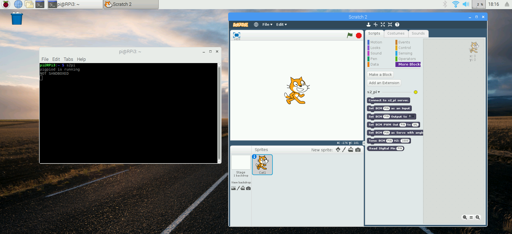
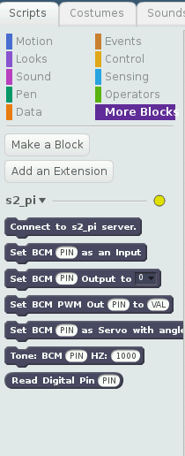

<center><span style="color:#990033; font-family:Georgia; font-size:3em;">s2-pi</span></center>

<center><span style="color:#990033; font-family:Georgia; font-size:2em;">Creating<br>Scratch 2
Extensions<br>On Your Raspberry Pi</span></center>

<br><br>
# Introduction

The [latest Raspbian image](https://www.raspberrypi.org/downloads/raspbian/) (2018-10-09) as of this writing,
 includes an
offline version of the Scratch 2 editor. It is based on Scratchx, a version of Scratch 2 that
supports Scratch 2 extensions. The previous *Jessie* version of Raspbian is also compatible
with s2-pi.

This tutorial will show you how to create your own custom extensions.

### What is a Scratch Extension?

A Scratch extension allows you to create, display and manage your own custom Scratch
blocks. The extension blocks appear in the More Blocks section
of the Scratch editor.

These blocks,
similar to the standard set of Scratch blocks,
can optionally contain drop down list menus and/or provide a place for users to enter
parameters. In addition, the extension contains the code that implements
 the block's *actions*.

 <div style="text-align: center;"></div>
   <br>

 <div style="text-align: center;"></div>


The extension file is written in JavaScript and must meet the criteria described in the [Scratchx
 extension documentation](https://github.com/LLK/scratchx/wiki#contents).

We will be using the [s2-pi](https://github.com/MrYsLab/s2-pi) project to illustrate how an extension
is created. The s2-pi project adds blocks to Scratch that allow you control GPIO pins on the Raspberry
Pi. The custom Scratch blocks created with s2-pi are shown above.

If you are not particularly interested in GPIO control, but would still like to build an extension
to meet your own needs, this tutorial will help get you started. Although my interest is in GPIO
control, extensions need not be limited to GPIO control.

Upon completing this tutorial you should be able to create an
extension that can do almost anything you can imagine!

# Let's Get Started

Here is what we are going to be doing:

* Install the s2-pi demo code and its dependencies.
* Using the s2-pi code, learn how to create and install custom blocks into Scratch.
* Create a Python server that will interact with the custom blocks. The server is optional, but
implementing a server greatly increases the capability and flexibility of the extension.

OK, before heading into the details, let's talk a little bit about what this demo extension
actually does.

## The s2-pi Demo
This demo creates 6 custom Scratch extension blocks.
The function of these blocks can be summarized as follows:

* A block that establishes communication between Scratch and a Python server.
* A block that allows you to set any GPIO pin to a high or low state.
* A block that allows you to control the output level of any GPIO pin using PWM.
* A block that allows you to control a servo motor and sets its angle.
* A block that will generate a tone on any GPIO pin that is connected to a piezo buzzer device.
* A block that allows you to set any GPIO pin as an output pin.
* A block that allows you get the current state of any pin that has been set as an output.

**Please Note:** This demo uses Python 3 (included with the Raspbian distribution). When coding
 your own server, you can choose to use Python 2 or 3, or if you prefer to code purely in
 JavaScript, you can code the server using node.js.

## Installing s2-pi

The preferred installation method is to use the *pip tool*. To install using *pip* open a
terminal window and type:

```
sudo pip3 install s2-pi

```

You can also install s2-pi by downloading the code from Github.

Here is how to use this alternative method:

Download the code from [Github](https://github.com/MrYsLab/s2-pi)

1. Click on the download button on the Github page.
    <div style="text-align: center;"></div>
    <br>

2. Unzip the file. For the purposes of this discussion, the files were extracted into
    the home directory **/home/pi**. The screen shot below shows the directory structure after
    unzipping.

    <br>
    <div style="text-align: center;"></div>
    <br>

3. Go to /home/pi/s2-pi-master and type:

`
sudo python3 setup.py install
`

The installation will:

* Copy the extension file, s2_pi.js into your home directory, making it easy to find.
* Place a startup executable, *s2pi* on the executable path that both starts the server
 and Scratch 2 in one command.
* Place a file name conversion utility, _sbx_to_sb2_, on the executable path, to convert
Scratch .sbx files to Scratch .sb2 files.

**_IMPORTANT NOTE_**: The *s2-pi* server uses the [pigpio](http://abyz.co.uk/rpi/pigpio/) library
 for GPIO pin control. This library is included with the Raspbian distribution, and *s2pi*
 will start the *pigpiod* daemon process automatically.

If you wish to have the *pigpiod* daemon start automatically at boot time, open a
terminal window and then type:


```
sudo systemctl enable pigpiod
sudo systemctl start pigpiod
```

You need only do this procedure once - after executing these two commands, *pigpiod* will
automatically be started each time you boot your Raspberry Pi.


## Starting The s2-pi Server
Next, to start s2-pi, in a command terminal type:

`
s2pi
`

Notice this command contains 4 characters without a dash character.


This command starts both the server and opens up the Scratch editor.

<div style="text-align: center;"></div>
<br>

You may see some warnings in the console window generated by Scratch. These can safely be
ignored.

## Installing The s2-pi JavaScript Extension File Into The Scratch Editor

There are 2 possible methods for installing an extension into Scratch.
The first method is the
simpler method. It is most useful when developing a new extension or trying out an
extension for the first time.

Once you have finalized your extension design, you may wish to install your extension
into the *Scratch
Extension Library*, making it easier for your users to access and use your extension.
The *Method 2* discussion will explain how this is accomplished.

<div style="text-align: center;"></div>
   <br>

Select the method that best suits your needs.

## Extension Installation Method 1- Using File Menu

To install using this method, while holding the Shift key on your keyboard,
click on the File menu choice at the top of the Scratch 2 window.
Select **Import Experimental Extension** and you will be
prompted for a URL to load the file:

   <div style="text-align: center;"></div>
   <br>

You need to supply the full path and file name of the JavaScript extension for the URL. Unfortunately,
 Scratch does not allow cut and paste into this dialog box, so it needs to be entered manually. In
 addition, wildcards are not allowed, so the entire path and file name must be entered.

The path and file we will be using is:

`
/home/pi/s2_pi.js
`

If you click on the **More Blocks** tab, you should now see the extension blocks appear.

<div style="text-align: center;"></div>
   <br>

If you do not see the blocks appear, check the path and file. If Scratch cannot find the file,
it remains silent. *Not very friendly*.

When developing your own JavaScript extension file, if there are any syntax errors within the
file, the blocks will not appear, and once again, Scratch is silent. *Even less friendly*.

##Extension Installation Method 2  - Adding An Extension to the Extension Library

You can also have your extension appear for selection in the *More Blocks* section by pressing
the *Add an extension* button.

<div style="text-align: center;"></div>
   <br>


<div style="text-align: center;"></div>
   <br>

To add an extension to the *Extension Library* we will need to perform the following steps:

1. Download a copy of the JavaScript extension file to /usr/lib/scratch2/scratch_extensions.
1. Download a modified copy of /usr/lib/scratch2/scratch_extensions/extensions.json
 so that our extension is added.
1. Download an icon for our extension into /usr/lib/scratch2/medialibrarythumbnails.

We will download these files for the sake of this tutorial. When creating your own
extension, you would copy the files directly from your workspace.


### Downloading the JavaScript Extension File

Open a terminal window and type:
```
cd /usr/lib/scratch2/scratch_extensions
```

Then execute the following line in the terminal window:

```
sudo curl -o s2_pi.js  https://raw.githubusercontent.com/MrYsLab/s2-pi/master/s2_pi/s2_pi.js
```


### Download a Modified Version Of extensions.json

To have the extension appear in the Extension Library Page, we need to add a line to
/usr/lib/scratch2/scratch_extensions/extensions.json describing our extension.

The line has already been added to the file we will download, but first, let's take a look
at the format of the entry.

```
{ "name":"Custom Pi GPIO", "type":"extension", "file":"s2_pi.js", "md5":"mry.png", "url":"https://mryslab.github.io/s2-pi/", "tags":["hardware"]  },
```
The json entry contains the following fields:

1. name - The title that will appear in the Extension Library pagefor our extension.
2. type - This needs to be set to "extension".
3. file - This is the name of our JavaScript extension file.
4. md5  - This is the name of the icon file we wish to have appear in the Extension library
 page.
5. url  - This is the URL for documentation for the extension.
6. tags - The category that our extension is part of. This needs to be set to "hardware"

We can download a file that already has the additional line added.

Make sure that the terminal window is still in /usr/lib/scratch2/scratch_extensions,
then type:

```
sudo curl -o extensions.json  https://raw.githubusercontent.com/MrYsLab/s2-pi/master/additional_files/extensions.json

```

### Download An Icon File

To download the MrYsLab logo, first type the following in the terminal window:

```
cd /usr/lib/scratch2/medialibrarythumbnails
```

Next type:

```
sudo curl -o mry.png  https://raw.githubusercontent.com/MrYsLab/s2-pi/master/docs/images/mry.png

```

### Installing The Extension From The Extension Library

After starting s2pi, when the Scratch editor appears, go to the More Blocks section of the
editor.

<div style="text-align: center;"></div>
   <br>

Click on the Add an Extension button and the Extension Library page will appear.

<div style="text-align: center;"></div>
   <br>

Double click the MisterYsLab icon, and the extension blocks should appear.

<div style="text-align: center;"></div>
   <br>

## Removing A Scratch Extension

When developing an extension, you will probably need to reload it multiple times as you add features
and get the bugs out. To remove an extension, click on the arrow next to the extension name and select
**Remove extension blocks**.

You are now ready to make your changes and to reload the extension.

<div style="text-align: center;"></div>
   <br>


## Using The s2-pi Blocks

Now that the JavaScript extension has been loaded and the server is running, you can try using
the extension blocks within the Scratch editor.

As each custom Scratch block is executed, the terminal window will display the message sent from
the extension to the server. If a pin is set to be a digital input, and the pin
changes state, the changes for that pin
will also be displayed in the console with the pigpio callback information.

<div style="text-align: center;"></div>
   <br>

The NOT SANDBOXED message is coming from Scratch because we started Scratch from
inside a terminal window. This message can be safely ignored.

### Opening A Communication Channel Between The Extension And The Server

Scratch does not provide a mechanism to
automatically connect a communication channel between the extension and the server.
Therefore, the **_Connect to s2-pi server block_**
must be executed before using any of the other blocks.

If you forget to do this, an alert will appear on the screen. In addition, the connection indicator
will be yellow.

<div style="text-align: center;"></div>
   <br>

When the connection is complete the indicator will go from yellow to green.

<div style="text-align: center;"></div>
   <br>

<div style="text-align: center;"></div>
   <br>


### Changing The State Of A Digital Output Pin

If you have a device, such as an LED connected to a GPIO pin, you can set its state to a "1" or "0"
by using the **_Set BCM Output block_**.

### Changing The State Of A Digital Output Pin Using PWM
Using the same LED device, you can set its brightness (from 0 to 255) using the **_Set BCM PWM Output_** block.

### Getting Input From A Digital Input Pin

If you have a device, such as a switch, connected to a GPIO pin, you can read the switch's current
state. First, you must set the pin as an input using the **_Set BCM as Input_** block. This sets up pigpio
to provide notification of a state change on the pin. Now to see the current state, use the Read Digital
Pin reporter block.

### Controlling A Servo Motor
If you connect a servo motor to a GPIO pin, you can control its movement between 0 and 180 degrees by using the
**_Set BCM As Servo_** block.

### Playing A Tone

If you connect a Piezo buzzer to a GPIO pin, you can play a short tone by using the **_Tone_** block.

# Creating a JavaScript Extension File

The format for the JavaScript extension file has been defined by the Scratch team and
you can view the specification [on this web page](https://github.com/LLK/scratchx/wiki#contents).

The JavaScript extension file is comprised of boiler plate code,
block descriptor code that creates the Scratch blocks in the Scratch editor,
and the code that you write that acts as a callback for the blocks created in the descriptor section.

This was mentioned previously, but we will take this opportunity to mention it again. As you write
your JavaScript extension code
and install it into the Scratch editor, the installation may result in no blocks being displayed.
If you introduce any errors in the file, Scratch silently fails, leaving you to debug your
file without any help from Scratch. Therefore it is a good idea to work on things incrementally.


## Basic Boiler Plate

I would suggest, first starting with the basic boiler plate provided in the specification.

```
(function(ext) {
    // Cleanup function when the extension is unloaded
    ext._shutdown = function() {};

    // Status reporting code
    // Use this to report missing hardware, plugin or unsupported browser
    ext._getStatus = function() {
        return {status: 2, msg: 'Ready'};
    };

    // Block and block menu descriptions
    var descriptor = {
        blocks: [
        ]
    };

    // Register the extension
    ScratchExtensions.register('Sample extension', descriptor, ext);
})({});

```

Just copy this code into your favorite editor, and save the file with a .js extension.
Then load the file into Scratch. You should then see something like this in the Scratch Editor.
Remember to select More Blocks or you will not see the custom blocks. In this case, we have
not yet defined any blocks, and that is why no blocks appear.

<div style="text-align: center;"></div>
   <br>

Now let's modify the boiler plate slightly to change the indicator from the default green to yellow.
Also, we will change the title of the extension from "Sample Extension" to "My Extension".

```
(function(ext) {
    // Cleanup function when the extension is unloaded
    ext._shutdown = function() {};

    // Status reporting code
    // Use this to report missing hardware, plugin or unsupported browser
    ext._getStatus = function() {
        return {status: 1, msg: 'Ready'};
    };

    // Block and block menu descriptions
    var descriptor = {
        blocks: [
        ]
    };

    // Register the extension
    ScratchExtensions.register('My extension', descriptor, ext);
})({});

```

To change the color of the indicator,  **_status_** was set from a value of 2 to 1,
and to change the extension name, the line near the bottom of the file was modified.

<div style="text-align: center;"></div>
   <br>


## Block Descriptor Section

The specifications for creating different types of blocks, including adding drop down menus
and parameter fields within the blocks is nicely documented on
the [Scratch page](https://github.com/LLK/scratchx/wiki#contents),
so we won't cover that information in detail here. Let's just take a quick look at the
blocks descriptors that s2-pi uses.

```
    // Block and block menu descriptions
    var descriptor = {
        blocks: [
            // Block type, block name, function name
            ["w", 'Connect to s2_pi server.', 'cnct'],
            [" ", 'Set BCM %n as an Input', 'input','PIN'],
            [" ", "Set BCM %n Output to %m.high_low", "digital_write", "PIN", "0"],
            [" ", "Set BCM PWM Out %n to %n", "analog_write", "PIN", "VAL"],
			[" ", "Set BCM %n as Servo with angle = %n (0° - 180°)", "servo", "PIN", "0"],     // ***Hackeduca --> Block for Servo
            [" ", "Tone: BCM %n HZ: %n", "play_tone", "PIN", 1000],
            ["r", "Read Digital Pin %n", "digital_read", "PIN"]

        ],
        "menus": {
            "high_low": ["0", "1"]

        },
        url: 'http://MrYsLab.github.io/s2-pi'
    };

```

A block descriptor consists of several fields.

* The first field describes the shape of the block.
Command blocks are created by setting the first fields to " ".  A reporter block is created by setting
this field to "r".
* The second field is the text that
appears in the block. Within that text, you might include a drop down menu, shown by using %m. The
menu contents are defined within the *menu* section of the block descriptor.
You can also have the block provide blanks for the
user to input parameters for the block. %n indicates that this parameter will be a number.
* The third field is the name of the function that will be called when the block executes.
You will need to provide the contents of that function within the extension file.
* The remaining fields provide default values for the parameters defined, if any, in the second
descriptor field.

## Block Handlers

Once you have your blocks created and are able to successfully load them into Scratch,
it is time to create the code for the block handlers.

## A Really Simple Example

Now let's create a really simple extension file that will do all of the processing within
the JavaScript file (no server is needed). When this extension is loaded, the indicator is set
to yellow. When the **_Start The Program_** block is executed, it will turn the indicator from
yellow to green.

```
(function(ext) {

   var myStatus = 1 ; // initially set status to yellow
   // Cleanup function when the extension is unloaded

   ext._shutdown = function() {};

   // Status reporting code

   // Use this to report missing hardware, plugin

   // or unsupported browser

   ext._getStatus = function() {
     return {status: myStatus, msg: 'Ready'};
   };

   // added function to support the Start The Program block
   ext.goGreen = function() {
     myStatus = 2;
   };

   // Block and block menu descriptions
   var descriptor = {
     blocks: [
       [" ", "Start The Program", "goGreen"]
     ]
   };

   // Register the extension
   ScratchExtensions.register('My extension', descriptor, ext);
 })({});

```

In this extension, We add a variable, **_myStatus_** and initialize it with a value of
"1".

The _getStatus method, a method that Scratch calls periodically to set the indicator, has
been modified. We changed the hard coded value for status to be the myStatus variable. Because
myStatus is set to "1" the indicator is initially yellow.

We defined a **_Start The Program_** block and in the descriptor indicated that this block will
be handled by the **_goGreen_** function.

The goGreen function, called when the block is used in a Scratch script, sets myStatus to "2", which
 will turn the indicator to green.

As you can see, it is possible to perform all of the processing in the JavaScript extension. In fact,
the default extension provided with Scratch for the Raspberry Pi, "Pi GPIO", does just that. It
controls the GPIO pins by making some low-level GPIO calls.

However, if you wish to start connecting more complicated devices, such as i2c devices,
programming may get to be difficult, if not impossible, because of the limitations imposed by
Scratch on the extension file.

For example, getting the "Pi GPIO" extension to play a tone would be, to say the least, a challenge.

To get around the restrictions imposed by the Scratch editor, we can add a server
for flexibility and ease of programming.

# Providing A Communication Channel Between Scratch And The Server
As mentioned before, you can do all processing within the extension if you wish,
but personally, I prefer to
"outsource the rough stuff" to another process. For s2-pi, that process is s2_pi.py.

The one complication is that we need a way for the Extension and server process to be able to
communicate with one another, asynchronously and bi-directionally. Whenever a command extension
block is executed, it needs to be able to send the command, in addition to any parameters that may
be associated with that command, to the server process.

And in the other direction, from the server to the extension, the server needs to be able to notify
the extension whenever a reporting event occurs.

The communication should be asynchronous in that neither the extension nor the server should need
to poll for incoming messages. This makes the system a lot more efficient and easier to program.
Not having
the need for complicated concurrency schemes is a plus. When a message arrives, it essentially
generates an event that triggers the processing of that message. When no messages are available,
the program is essentially dormant.

## Some WebSocket Background

WebSockets satisfy all of our communication needs rather nicely, and since it is already
built into Scratch, extension implementation is greatly
simplified. Unfortunately, none of this is documented by the Scratch team. Don't worry,
 we will show you how to use WebSockets in the extension. For the server, we just need to create a
 class that implements the server inherited from
a WebSocket library base class. Again, you will be shown how to manage WebSockets on the server side as well.
All in all, it is a pretty elegant and simple solution for our communication needs.

A WebSocket is [defined by Wikipedia](https://en.wikipedia.org/wiki/WebSocket) as a
"a computer communications protocol, providing full-duplex communication channels
over a single TCP connection". WebSockets by their nature are event driven, and therefore are a perfect
fit for our needs.

Similar to an IP socket, one side of the connection acts as the client that initiates the socket,
and the other
side is the server that accepts connection requests and completes the connection.

For s2-pi the extension is the client, and the server is, you guessed it, the server.

The WebSocket API requires some methods to be implemented to support the WebSocket event
driven protocol.

Let's take a look at how s2-pi establishes a WebSocket, and the code it uses to do so.

## Establishing The Connection

In order to establish a connection, we first need a WebSocket server to be running and ready
to accept connection requests. The s2_pi.py server, S2PI,  inherits from the WebSocket class.
S2PI needs to overwrite and implement 3 methods inherited from the base class:

* handleConnected
* handleMessage
* handleClose

Similarly, on the client, JavaScript extension side, we need to implement a similar set of functions.

* window.socket.onopen
* window.socket.onmessage
* window.socket.onclose

In [s2_pi.py](https://github.com/MrYsLab/s2-pi/blob/master/s2_pi/s2_pi.py),
the function near the bottom of the file, **_run_server_**, in addition to starting
up Scratch, instantiates the WebSocket providing the IP address and port
number we wish to use. We also need to pass a reference to our implementation
class (S2PI) so that the overwritten methods within S2PI will be called
when a WebSocket event occurs.
The last line of the method assures that the WebSocket server will run "forever".

```
def run_server():
    os.system('scratch2&')
    server = SimpleWebSocketServer('', 9000, S2Pi)
    server.serveforever()

```
The run_server method is called when we start s2_pi.py:

```
if __name__ == "__main__":
    try:
        run_server()
    except KeyboardInterrupt:
        sys.exit(0)


```
Once **run_server** is called, S2PI is waiting for a connection request.

Now it's the extension's turn to initiate the connection request.
In order for the server to receive a connection request, the
**_Connect to s2_pi server_** block must be executed within a Scratch script.
Activating this block calls the **_cnct_** function within our JavaScript extension.
`
The *cnct* function instantiates a WebSocket using the same IP address and port number used by the server.
The instantiation issues a connection request.

```
ext.cnct = function () {
        window.socket = new WebSocket("ws://127.0.0.1:9000");

```

When the server receives this connection request, a handshake between both sides ensues, and
if the connection is successful, **_handleConnected_** is called.

On the extension end, a successful connection results in **_window.socket.onopen_** being
called.

Both sides are now ready to send and receive messages.

## Formatting Messages To Go Across The Network

By convention, our application will use a hash/dictionary data structure to construct
our messages. A hash (JavaScript) and dictionary(Python) are roughly equivalent data structures,
that allow the easy extraction of data using name/value pairs.

Luckily, the syntax for both JavaScript and Python are the same.

Here is a list of messages constructed and sent by the Scratch extension to notify the
server that a command block has been executed:

```
Block:                    Connect To s2-pi Server
Message:                  {'command': 'ready''}

Block:                    Set BCM Pin As An Input
Message:                  {'command': 'input', 'pin': pin}

Block:                    Set BCM Output To
Message:                  {'command': 'digital_write', 'pin': pin, 'state': state}

Block:                    Set BCM PWM Output
Message:                  {'command': 'analog_write', 'pin': pin, 'value': value}

Block:                    Set BCM as Servo
Message:                  {'command': 'servo', 'pin': pin, 'value': value}

Block:                    Tone
Message:                  {'command': 'tone', 'pin': pin, 'frequency': frequency}

```

Notice that each of these messages has a **_command_** field to identify the type of message.
When the server receives a message, it simply dereferences the command field to determine the action
to take.

On both sides of the interface, we convert the hash/dictionary message structures into strings
using JSON, so that message can be carried over the network. When a message is received,
we need to reconstruct the string back to the native data structure so that we can easily access
all the fields of the message.

To convert from a hash to a string on the extension side, the JSON.stringify method is used.

```
var msg = JSON.stringify({
                "command": "ready"
            });
            window.socket.send(msg);
```

The converted message is then sent over the socket using the **_send_** function.

When the message is received on the server side, it needs to be converted from the string representation
back to the native data structure.

The **_handleMessage_** method in s2_pi.py performs this conversion.

`
payload = json.loads(self.data)
`

Here the string, represented as self.data, is converted back to the data structure by the call to
json.loads. The converted string is assigned to the payload variable and can now be manipulated as
a standard Python dictionary.

You've probably noticed that all the WebSocket action of interest is handled by
**_window.socket.onmessage_** on the JavaScript side, receiving any messages that the server sends,
such as reporter data, and **_handleMessage_** on the Python side, receiving all the command
requests from the extension.

## Reporter Blocks

For S2PI, the only reporter block is **_Read Digital Pin_**. Before using this block in a Scratch
script,
the **_Set BCM as an Input_** block must first be used.

The following is the implementation function in the extension for this block:

```
ext.input = function (pin) {
        if (connected == false) {
            alert("Server Not Connected");
        }
        // validate the pin number for the mode
        if (validatePin(pin)) {
            var msg = JSON.stringify({
                "command": 'input', 'pin': pin
            });
            window.socket.send(msg);
        }
    };

```

We first make sure that a connection was established, and if not an alert is generated in the
Scratch editor. Next, we make sure that the pin specified is valid. The check to do this simply checks
the pin is in the range of 0-31. Finally, we create and send a message with a command of "input"
supplying
the pin number that the user entered in the block.

When the server receives this message, the selected GPIO pin is set to be an input pin.

```
    def handleMessage(self):
        # get command from Scratch2
        payload = json.loads(self.data)
        print(payload)
        client_cmd = payload['command']
        # When the user wishes to set a pin as a digital Input
        if client_cmd == 'input':
            pin = int(payload['pin'])
            self.pi.set_glitch_filter(pin, 20000)
            self.pi.set_mode(pin, pigpio.INPUT)
            self.pi.callback(pin, pigpio.EITHER_EDGE, self.input_callback)

```

Here is the beginning of the server's **_handleMessage_** method. The first thing that happens is
when a message is received, is that the message is converted back to a dictionary.

The message just received was an **_input_** command message. The pin number is extracted from the
message, converted from its string representation to an integer, and then 3 pigpio calls are made.

The first sets a "glitch" value. If using a push button switch, this will
[debounce](https://www.allaboutcircuits.com/technical-articles/switch-bounce-how-to-deal-with-it/)
 the switch.

Then the pin is set to be an input pin, and finally, we associate a callback method for pigpio to
call whenever there is a state change detected on the pin.

When a call back occurs, a message is constructed and sent to the extension notifying it of the
state change.

```
    def input_callback(self, pin, level, tick):
        payload = {'report': 'digital_input_change', 'pin': str(pin), 'level': str(level)}
        print('callback', payload)
        msg = json.dumps(payload)
        self.sendMessage(msg)

```

The **_json,dumps_** call translates the dictionary into a string.

The message is then sent with the sendMessage call.

The extension receives this message in its **_onmessage_** function.

```
window.socket.onmessage = function (message) {
            var msg = JSON.parse(message.data);

            // handle the only reporter message from the server
            // for changes in digital input state
            var reporter = msg['report'];
            if(reporter === 'digital_input_change') {
                pin = msg['pin'];
                digital_inputs[parseInt(pin)] = msg['level']
            }
            console.log(message.data)
        };
```

Here the message is converted back to a hash by the call to JSON.parse. The report type is checked
and the digital_inputs array is modified to reflect the state change.
The pin value is converted from its string representation to an integer and is used as an index to
store the state change information in the **_digital_inputs_** array.

When the **_Read Digital Input_** reporter block is encountered in a Scratch script,
its associated function is called. The current state of the pin associated with this block
is retrieved
by indexing into the **_digital_inputs_** array.

```
["r", "Read Digital Pin %n", "digital_read", "PIN"]

ext.digital_read = function (pin) {
        if (connected == false) {
            alert("Server Not Connected");
        }
        else {
                return digital_inputs[parseInt(pin)]

        }
    };
```


## Saving Your Project

After creating your project you can save it by selecting _File/Save Project_ in the Scratch
editor menu.

<div style="text-align: center;"></div>
   <br>

This will save your file with a .sbx extension.

The current version of the Scratch 2 editor contains a bug. If you go to save a project
when using a custom extension (for some reason this bug does not occur if you use one of
the two "standard" extensions supplied with the editor), the file is saved with a .sbx
extension. When you go to load a previously saved project, .sbx files do not appear in the
project choice menu. To get around this, .sbx projects need to be renamed using a .sb2
extension.

The s2-pi distribution supplies a utility that will rename all .sbx files to .sb2 files for
a given directory.

To use this utility, open a terminal window and CD into the directory that contains
the .sbx project files.

Next type the following to properly rename the files:

```
sbx_to_sb2
```

If you modify a project that was loaded with the .sb2 extension and then save it, the file
will be renamed with the .sbx extension.

Hopefully, this rather annoying bug will be fixed in the near future.

## Reloading A Saved Project
When you select File/ Load Project, only .sb2 files are shown in the file chooser dialog.
Therefore if you saved a project and did not convert its file type, refer to the previous
section _Saving Your Project_, to learn how to convert the file to the correct type.

After fixing the file extension type, if you then select _File/Load Project_, the .sb2 files be available
 for selection in the file chooser dialog.

### Red Blocks
If you installed the extension [using method 1](/#extension-installation-method-1-using-file-menu), then
when you load a previously saved project, you will see the extension blocks come up as
_red blocks_:

<div style="text-align: center;"></div>
   <br>

To solve this problem, just reload the extensions blocks as described
in the _Installing The s2-pi JavaScript Extension File Into The Scratch Editor_ section of
this document.

After doing so, the extension blocks should be restored.


# Go Forth And Code!

We have explored:

* Creating a JavaScript Extension File
* Creating a Python server derived from the WebSocket class
* Constructing and sending messages, both in the extension and the server.
* Receiving, deconstructing and processing the message for both the extension and server.

With that in hand, you should have a good idea of how to code both the JavaScript extension and
the associated server side code.

If you have any comments, questions or suggestions, please let me know at:

[MisterYsLab@gmail.com](mailto:MisterYsLab@gmail.com])

# Contributors
The servo control code was developed and supplied by [Edson Sidnei Sobreira](https://www.hackeduca.com.br/)


